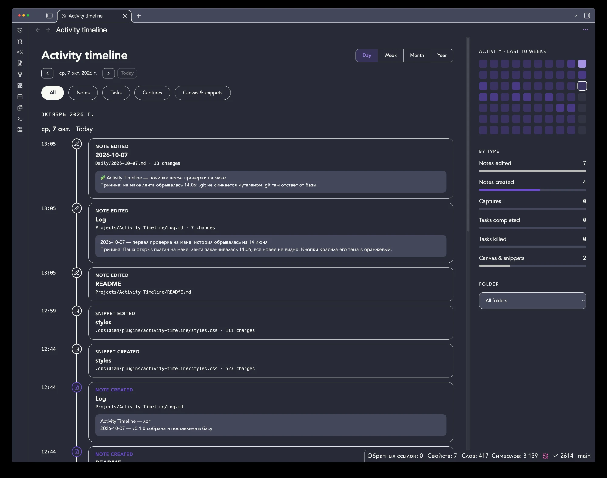
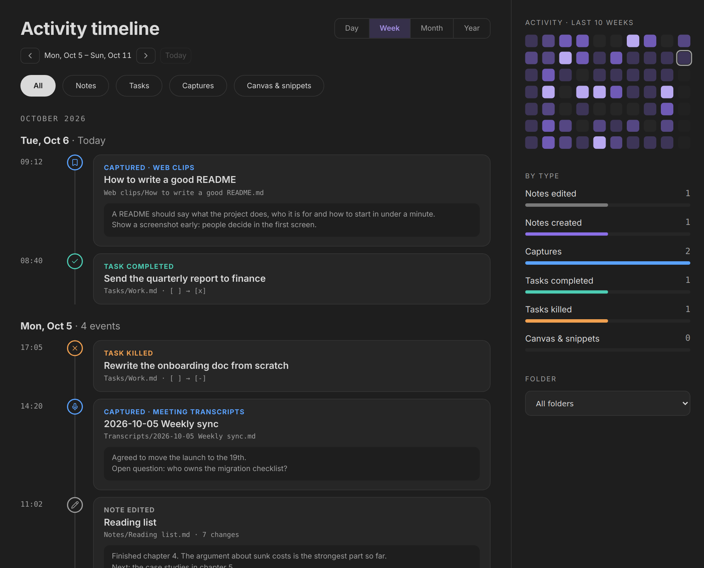

# Activity Timeline

> **Credit.** This plugin is built on the idea and the mockup by [u/thecroissantproject](https://www.reddit.com/user/thecroissantproject/), from their post [Comprehensive historical timeline of my actions across Obsidian?](https://www.reddit.com/r/ObsidianMD/comments/1wz07ws/comprehensive_historical_timeline_of_my_actions/) on r/ObsidianMD. The design, the event types and the layout come from that mockup. I only wrote the code. I am not affiliated with them.

A timeline of everything that happens in your vault: notes created and edited, tasks completed and dropped, things you captured. It shows what you actually did today, this week or this year.





*The second image is the plugin rendered with made-up sample data.*

## What it does

- **Event feed** grouped by day. Each card shows the note, the path and the first changed lines, so you recognise an edit without opening the note.
- **Day / Week / Month / Year** views, with previous and next buttons.
- **Filters** by type (notes, tasks, captures, canvas and snippets) and by folder.
- **Heatmap** of the last 10 weeks. Click a day to open it.
- **Counts by type** for the period you are looking at.
- **History from day one.** If your vault is a git repository, the plugin rebuilds past activity from the commits, including changes made while Obsidian was closed or by other tools and devices.
- Click a card to open the note at the changed line. Cmd/Ctrl-click opens it in a split.

The event types:

| Type | How it is detected |
| --- | --- |
| Note created | A new Markdown file. |
| Note edited | Changed non-blank lines in a Markdown file. Edits of the same note within 30 minutes merge into one event. |
| Task completed | A checkbox changes to `[x]`, or a new line appears already checked. |
| Task killed | A checkbox changes to `[-]`. |
| Capture | A new note whose path matches one of your capture rules. For example web clips, meeting transcripts or an inbox folder. |
| Canvas and snippets | Changes to `.canvas`, `.base` and `.css` files. The list is configurable. |

Moving a checked task to another place in a note is not counted as completing it.

## Before you start

**Try the plugin on an empty or throwaway vault first. Before you use it on a vault you care about, make a backup.**

The plugin is not supposed to delete or change any of your notes, and I have designed it not to. It reads your notes and git history, and writes only two files inside its own plugin folder: `events.jsonl` and `data.json`. The git commands it runs are read-only. The one exception is `git fetch`, which is off by default and only updates remote-tracking branches in `.git`.

But I cannot promise there are no bugs. The software is free and comes without any warranty, and I take no responsibility for lost or damaged files. A backup costs you a minute.

## How it works

The plugin has two sources of events and merges them.

**Live recording.** Obsidian tells a plugin that a file changed, but not what changed. So the plugin reads your notes into memory once at startup (roughly the size of your notes, capped at 80 MB). When a file changes and then stays quiet for 60 seconds, the plugin compares the new text with the copy in memory and records what is different. This also covers changes made by sync tools and scripts while Obsidian is open.

**Git history.** If the vault is inside a git repository, the plugin reads `git log -p` on start and every five minutes. The first run imports the last 365 days. Commits that touch more than 300 files (bulk imports, mass renames) are skipped, and renames without content changes are ignored. This is what gives you history from before you installed the plugin and covers the time Obsidian was closed.

**Catch-up.** If the git history is behind your files (for example `.git` is not synced between your machines), files newer than the last commit are shown from their modification dates. Those cards say "from file dates" and show one card per file with the total changes, not each edit.

When live and git describe the same edit, the live one is kept and the git one is dropped.

Everything is stored locally in `.obsidian/plugins/activity-timeline/events.jsonl`. Nothing is sent anywhere.

## Setup

Requirements: Obsidian 1.7.2 or newer on desktop (Windows, macOS, Linux). History from git needs the `git` program installed. Mobile is not supported.

1. Install the plugin: **Settings → Community plugins → Browse**, search for **Activity Timeline**. Or download `main.js`, `manifest.json` and `styles.css` from the [latest release](https://github.com/abbsol/obsidian-activity-timeline/releases/latest) into `<your vault>/.obsidian/plugins/activity-timeline/` and enable it.
2. Open the timeline with the history icon in the ribbon, or run the command **Activity Timeline: Open timeline**.
3. On the first start the plugin imports your git history. A notice shows when it is done.

What to configure in **Settings → Activity Timeline**:

| Setting | What to do |
| --- | --- |
| Captures | Add a rule for each place where notes arrive from outside: a path prefix such as `Clippings/` or `Projects/*/Transcripts/` (`*` matches one folder), a name, and a [Lucide](https://lucide.dev/icons/) icon name. Without rules there are no captures, those notes are just "created". |
| Excluded folders | Folders to ignore completely, one per line. |
| History source | `HEAD` by default. If this copy of your vault does not get commits locally but is backed up to a remote (for example another machine commits and pushes), set it to `origin/main`. |
| Fetch before importing | Turn on together with `origin/main` so that new commits are downloaded first. It needs working git credentials. |
| Keep notes in memory | Leave on to get excerpts for changes made outside the editor. Turn off if memory matters more. |
| Canvas and snippet file types | Extensions tracked besides notes. |

If your vault is a git repository with automatic commits, add `.obsidian/plugins/activity-timeline/events.jsonl` to your `.gitignore`. The file changes often and can be rebuilt from git.

## Limits

- Desktop only.
- Without git, history starts the day you install the plugin.
- Changes made by sync tools or scripts look the same as your own. The timeline is statistics for the whole vault, it does not know who made a change.
- Task detection knows `[x]` as completed and `[-]` as dropped. Other statuses are ignored.
- Time of git events is the commit time, not the moment of the edit.

## Questions, bugs, ideas

GitHub repositories have no comment section. Use the **[Issues](https://github.com/abbsol/obsidian-activity-timeline/issues)** tab: open a new issue for a question, a bug or an idea. For a bug, please include your Obsidian version, your operating system and what you expected to see. You can also reply under the [original Reddit post](https://www.reddit.com/r/ObsidianMD/comments/1wz07ws/comprehensive_historical_timeline_of_my_actions/).

## Contributing and license

The plugin is released under the [BSD Zero Clause License](LICENSE): free for any use, with no conditions and no need to credit anyone. Fork it, change it, publish your own version. If you want your changes in this one, send a pull request. I review pull requests together with Claude.

Development:

```bash
npm install --legacy-peer-deps
npm run dev      # watch build
npm test
npm run build
```

## Built with Claude

This plugin was written by Claude Code (Claude Sonnet 5.5) from my direction, and I reviewed and tested it on my own vault. It has not been audited by anyone else. Keep that in mind and keep your backups.

— Pavel Fedorov
